# A tour of the app

What each part of the web UI is for, shown on the Okan demo. The screenshots were taken from a local
`fuzer up` with no AI provider configured, so no answer on them was written by a model. Okan is a
fictional field and its data is synthetic and historical: dates in 2024 and 2025 are event dates in the
scenario, not today's operating state.

The sidebar holds the seven primary destinations: **Home**, **Explore**, **Investigate**, **Work**,
**Sources**, **Jobs** and **Settings** (plus **Demo** while it is enabled). Each opens a row of tabs for
its specialist pages. The panel at the foot of the sidebar names the facility and counts what is loaded;
in local mode, **You are** records who makes decisions (attribution, not sign-in).

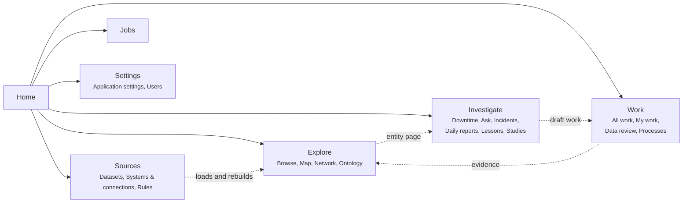
```mermaid
flowchart LR
  home["Home"] --> explore["Explore<br><small>Browse, Map, Network, Ontology</small>"]
  home --> investigate["Investigate<br><small>Downtime, Ask, Incidents,<br>Daily reports, Lessons, Studies</small>"]
  home --> work["Work<br><small>All work, My work,<br>Data review, Processes</small>"]
  home --> sources["Sources<br><small>Datasets, Systems & connections, Rules</small>"]
  home --> jobs["Jobs"]
  home --> settings["Settings<br><small>Application settings, Users</small>"]
  explore -.->|entity page| investigate
  investigate -.->|draft work| work
  work -.->|evidence| explore
  sources -.->|loads and rebuilds| explore
```

## Home and the demo

**Home** suggests where to start and summarises production efficiency, incidents and source and job
health, each linking to the page that owns it. With an empty register it points to the Sources setup
wizard instead.

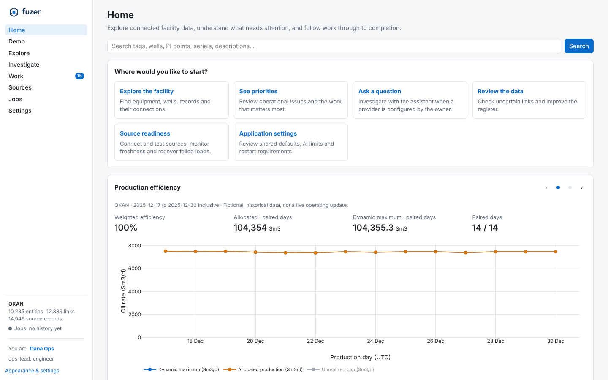{ loading=lazy }

**Demo** is a five-step guided introduction, and **Okan investigation** follows one train B compressor
issue from the asset to its source records and a cited finding. Neither generates data, calls a model or
changes work when a page loads.

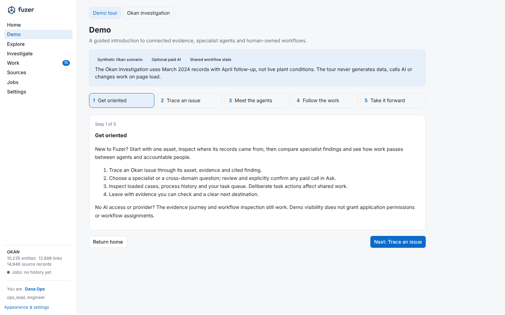{ loading=lazy }

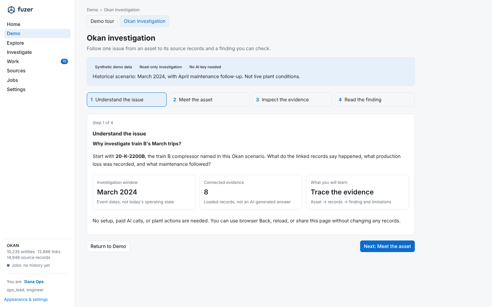{ loading=lazy }

## Explore

**Browse** searches tags, wells, PI points, serials and descriptions, with counts per kind. Every result
opens an **entity page**: the golden value of each field with the system it came from and what every other
system says (**why?** traces it to the record, mapping version and rule), the source records Fuzer decided
are this same thing, the flow trace, the map, process values, measurements and links.

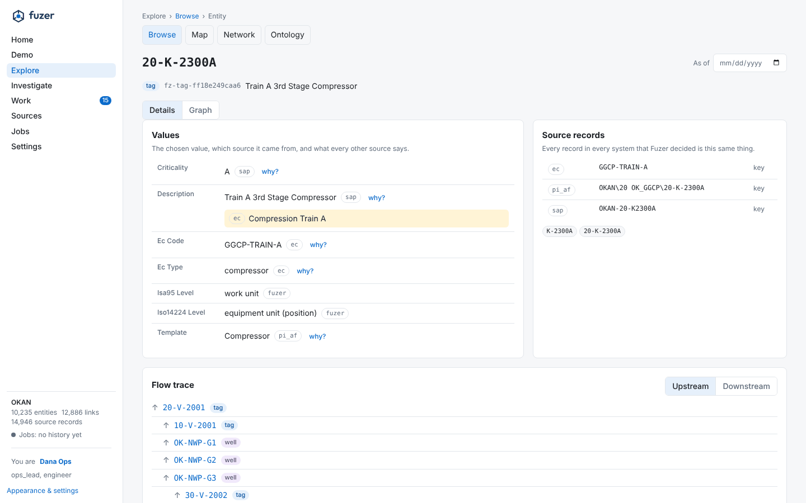{ loading=lazy }

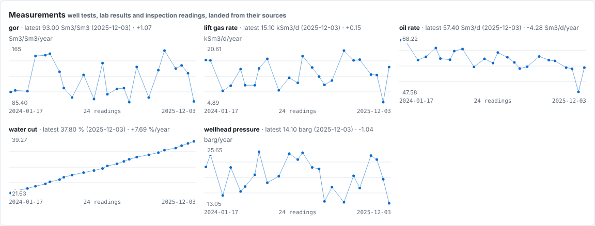{ loading=lazy }

**Map** shows located wells, platforms and pipelines; **Network** shows Energy Components allocation, gas
lift and P&ID piping as of a date, and its **3D** view draws a facility or an area as generic shapes (vessels as
cylinders, machines as blocks, jackets on lattice frames) with the links as pipe runs. It is a schematic laid out from
flow order, not a model of the plant: click a shape for its card and asset page. **Ontology** shows the data model itself, with circles sized by how many
entities of each kind are loaded.

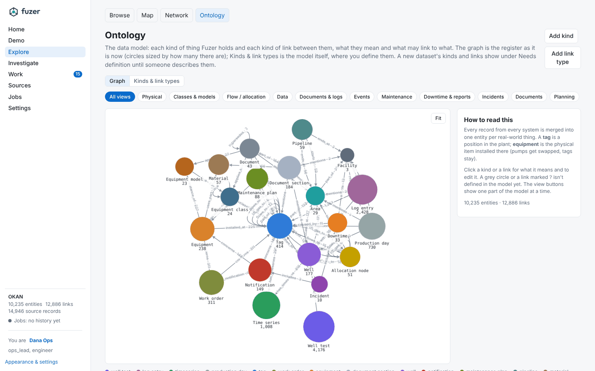{ loading=lazy }

## Investigate

**Downtime** ranks lost production by equipment, class and reason. **Incidents** groups downtime records,
log events and notifications on the same plant within a few days into one upset, and asks engineers to rate
each troubleshooting brief.

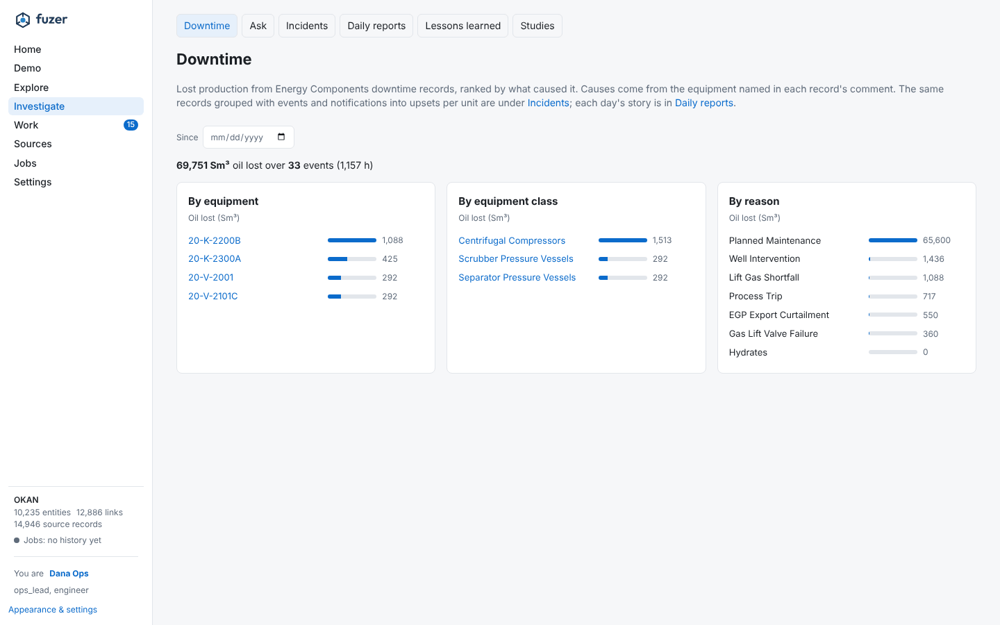{ loading=lazy }

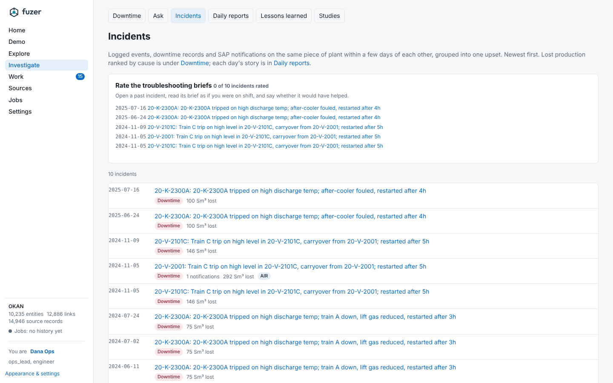{ loading=lazy }

**Ask** is the operations assistant: suggested questions per domain, the specialists and what they can't
do, and a prompt. It answers only from loaded evidence, cites every fact and never gives operating
instructions. It needs an AI provider configured by the owner, and each question is a deliberate paid call.

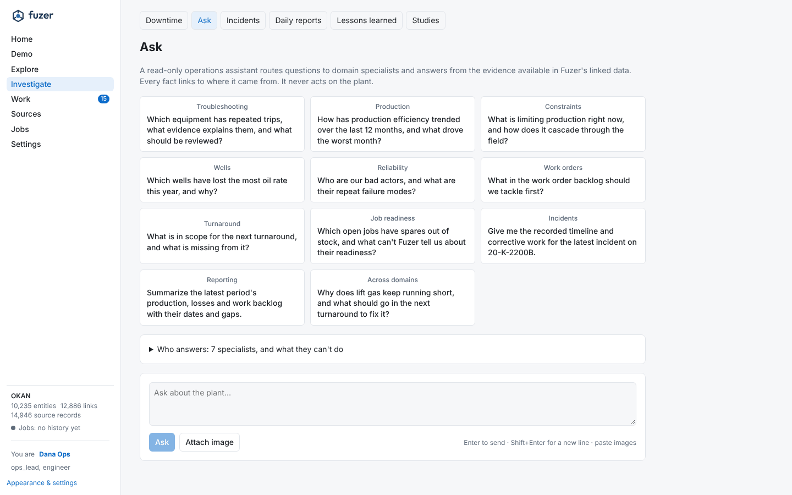{ loading=lazy }

**Daily reports** shows each production day's report: six fixed sections built from the day's records,
every line citing them, with checks for uncited lines and numbers that aren't in the facts. The reporter
agent rewrites the draft when the agent worker runs; here it is still the template draft.

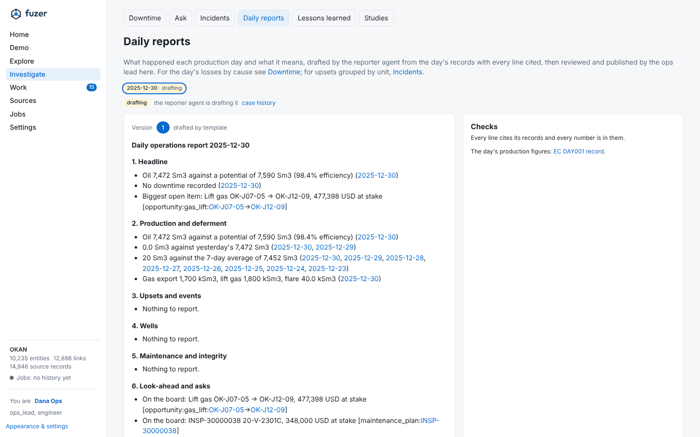{ loading=lazy }

## Work

**All work** is the IOC's one list, one row per event, with views for what needs dispatching, what is with
the field, what came back, what is in progress, what is closed, and everything ranked by value. **Ranked by value** ranks every outstanding piece of work: SAP backlog, PM and inspection plans,
incidents and upsets, workflow items, opportunities, reviews and projects. **Why** opens the value
breakdown, its records and rank history, and lets a person pin a rank with a reason.

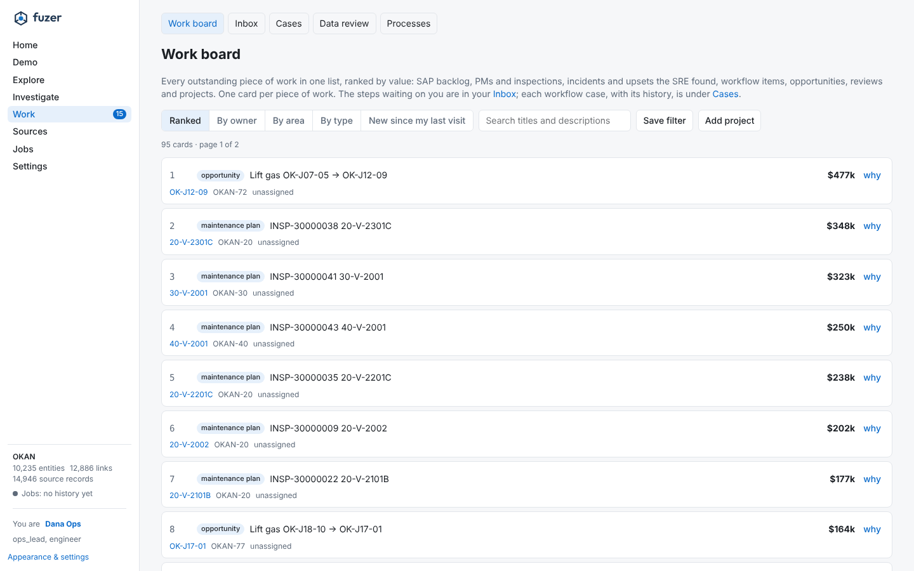{ loading=lazy }

**My work** is what waits on you: jobs the IOC sent you, steps assigned to you, and what is unclaimed in your
roles' queues. A field operator reports On site, Done or Could not do from a job's card here. A task opens as a
page with its form, its evidence, where it sits in its process and the case history.

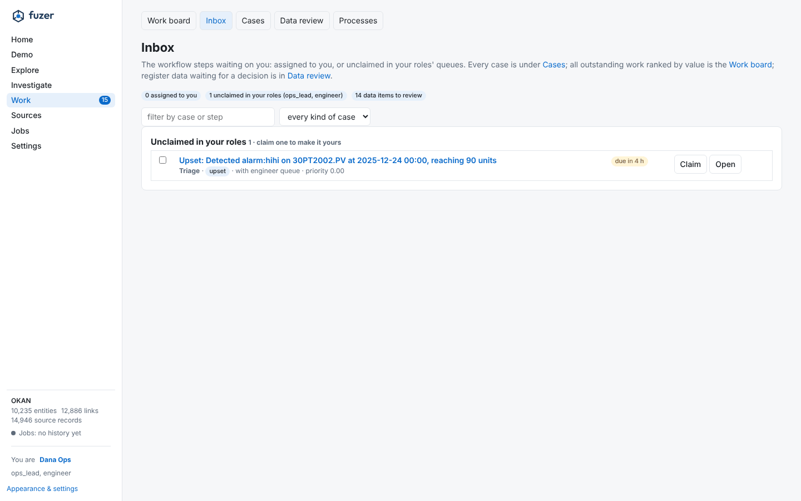{ loading=lazy }

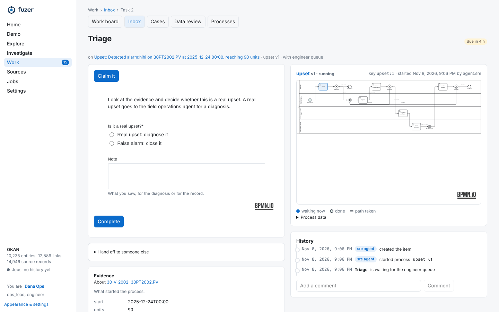{ loading=lazy }

All work's **In progress** and **Closed** views list every work item; a case page shows its process diagram with the path taken
and the step it waits on, and takes reassign, priority, due date, close and cancel.

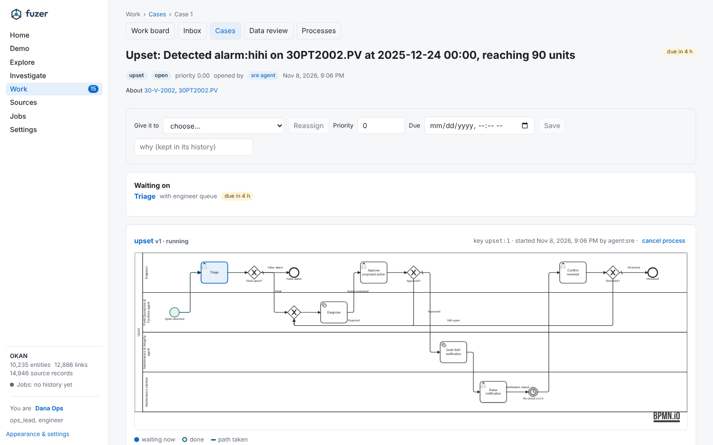{ loading=lazy }

**Data review** holds register decisions for a person: possible matches, conflicting values, schema
changes, new tables, datasheet curves and held loads. Each answer is kept and applied on every rebuild.

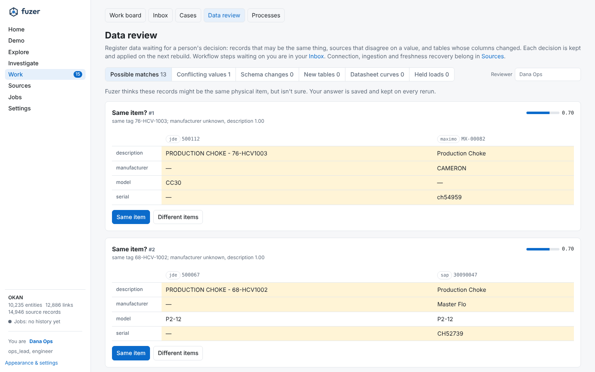{ loading=lazy }

**Processes** lists each BPMN process with its health, and opens Overview, Running, Model, Monitor and
SLAs & routing. Task forms are edited here too.

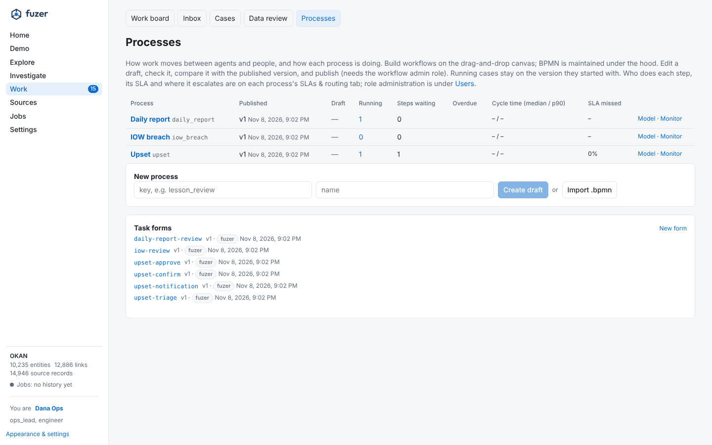{ loading=lazy }

## Sources, Jobs and Settings

**Sources** owns connecting, testing, loading and recovering source data: every dataset with its health,
last run, owner and schedule, and **+ Add a source** ([walkthrough](extend.md#from-the-ui)).

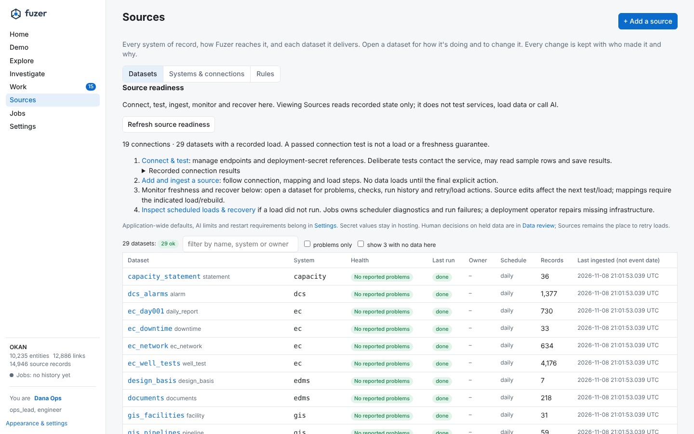{ loading=lazy }

**Jobs** shows each scheduled job's schedule or sensor, recent runs and data checks, read from Dagster.
**Settings** holds your appearance preference (saved in your browser) and the application configuration;
**Users** is where owners approve accounts and assign workflow roles.
